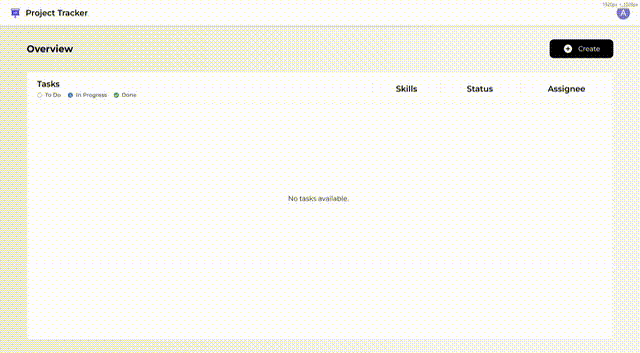

# Task Management System
A web application for managing tasks with hierarchical relationships, built with React and TypeScript.

## Demo


## Tech Stack
- React
- TypeScript
- Material-UI
- Axios
- React RTK Query
- SCSS
- Notistack
- Vite

## Features
- Create, and manage tasks with parent-child relationships.
- View tasks in a tree structure.
- Responsive design for various screen sizes.
- Form validation and user feedback using snackbars.
- Integration with a backend API for data persistence.
- Modular and reusable components for easy maintenance and scalability.
- State management using React hooks.

## Dockerization
- Dockerfile for containerizing the application.
- Docker Compose for easy setup and management of the application and its dependencies.
- Environment variable configuration for different environments.

 ### Setup and Run With Docker
1. Ensure you have Docker and Docker Compose installed on your machine.
2. Clone the repository:
   ```bash
   git clone
    cd task-assignment-fe
    ```
3. Create a `.env` file in the root directory and set the `API_BASE_URL` & `APP_VERSION` variable:
   ```env
    API_BASE_URL=http://your-backend-api-url
    APP_VERSION=1.0.0
    ```
4. Build and run the application using Docker Compose:
    ```bash
    docker-compose up --build -d
    ```
5. Open your browser and navigate to `http://localhost:5173` to access the application.

